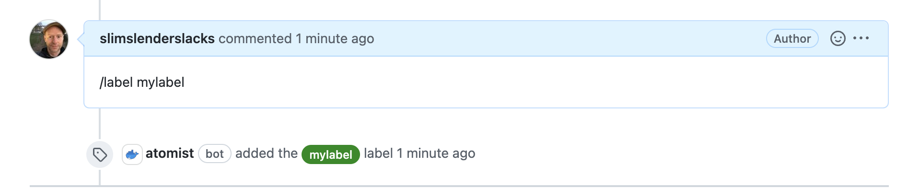

## Background

Skill that watches for commands embedded in issue/pr comments, or commit messages.

For example, type `/label ...` in an issue or pr comment to ensure that label exists and then add it.



More command examples are in the skill documentation.

## Requirements

* GitHub app installation must be enabled for the repo

## Running locally

This uses `container/v2`.  You can run locally using [atomist/local-skill](https://github.com/atomisthq/bb_scripts/tree/main/local-skill).

```
docker run --rm --init -it \
           --add-host host.docker.internal:host-gateway \
	   -v ${PWD}:/skill -v /var/run/docker.sock:/var/run/docker.sock \
	   atomist/local-skill --pwd /skill --workspace ${TEAM} --apikey "${APIKEY}" --host-dir ${PWD} --watch'

```

## Release

A new unstable version of the skill will be created for any push to main. 
